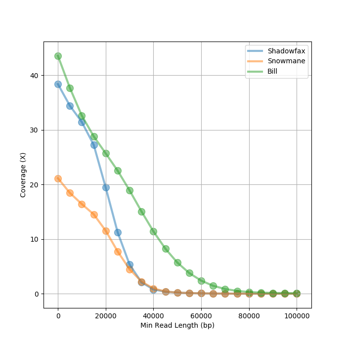
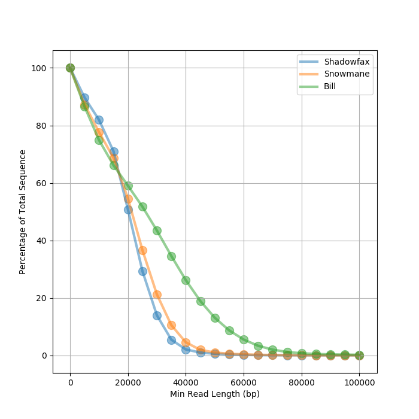

# PodPlot





## Dependencies

- Python3
- Matplotlib

## Usage

1. Convert fastq to fasta with [seqtk](https://github.com/lh3/seqtk).
2. Make a fastq index with [samtools](http://www.htslib.org/).
3. List the fai files:

```
$ cat fai.fofn
reads.1.fasta.fai	Shadowfax
reads.2.fasta.fai	Snowmane	
reads.3.fasta.fai	Bill
```

4. `python3 podplot.py fai.fofn` of `python3 podplot.py -g 1500000000 fai.fofn`
